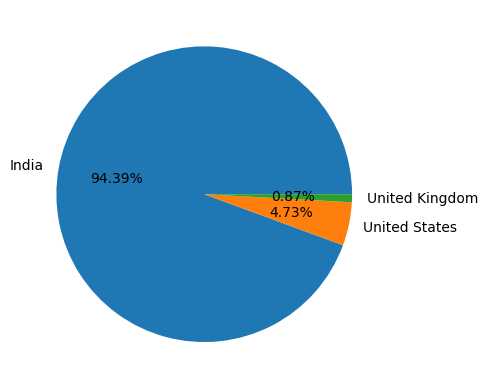
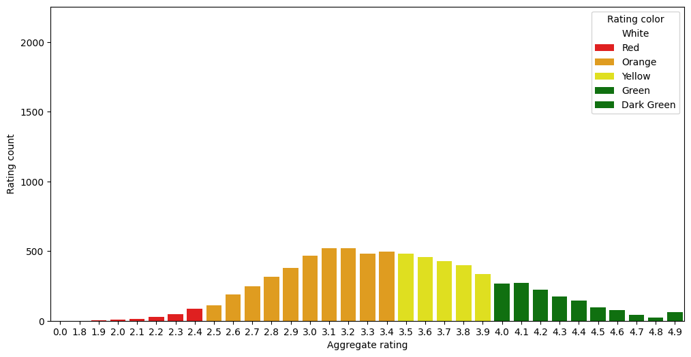
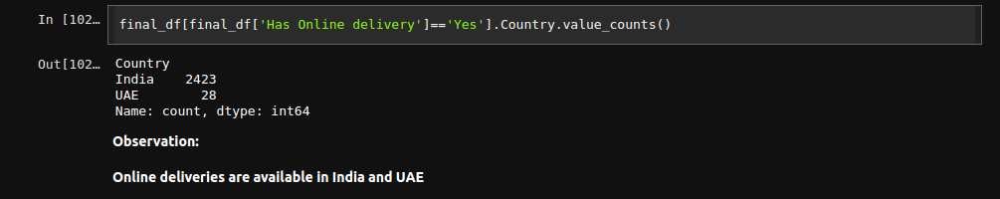
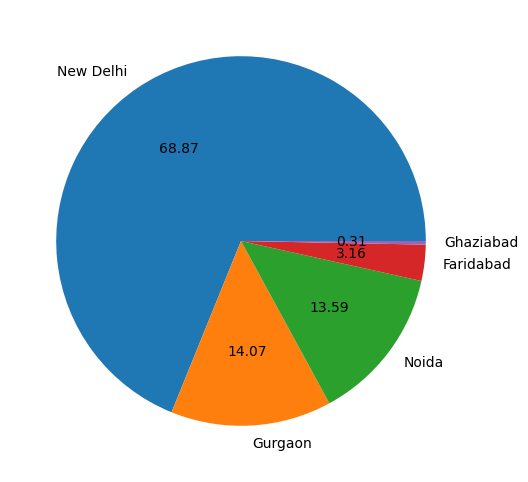

Here is a professional README for your Zomato Data Analysis project:

---

# Zomato Data Analysis
.png)

Welcome to the Zomato Data Analysis repository! This project explores the Zomato dataset to uncover insights about restaurants, cuisines, and customer ratings across various countries.

## Table of Contents
- [Introduction](#introduction)
- [Dataset](#dataset)
- [Installation](#installation)
- [Usage](#usage)
- [Key Insights](#key-insights)
- [Contributing](#contributing)
- [License](#license)

## Introduction

The Zomato Data Analysis project aims to analyze the Zomato dataset to gain valuable insights into customer preferences, popular cuisines, restaurant ratings, and other relevant metrics. By exploring this dataset, we can understand trends and patterns within the food industry across different countries.

## Dataset

The dataset includes information such as:

- Restaurant details (name, city, address, cuisines, etc.)
- Ratings and reviews
- Country information

## Usage

1. Load the dataset and perform initial exploration:
   ```python
   import pandas as pd

   data = pd.read_csv('zomato.csv')
   data.head()
   ```
2. Execute the analysis scripts to generate insights:
   ```sh
   python analysis.py
   ```
3. Visualize the results using Jupyter Notebook or similar tools:
   ```sh
   jupyter notebook
   ```

## Key Insights

Some of the key insights derived from the analysis include:

- **Country Distribution**: Most records are from India, followed by the USA and the UK.
  
- **Ratings**: The majority of ratings fall between 2.5 to 3.6 and not rated count is very high.
  
- **Online Delivery**: Available mainly in India and the UAE.
  
- **Top Cities**: New Delhi, Gurgaon, and Noida are among the top cities with the most restaurants.
  

  ## Installation

To get started with the project, follow these steps:

1. Clone the repository:
   ```sh
   git clone https://github.com/your-username/Zomato-Data-Analysis.git
   ```
2. Navigate to the project directory:
   ```sh
   cd Zomato-Data-Analysis
   ```
3. Install the required dependencies:
   ```sh
   pip install -r requirements.txt
   ```


## Contributing

Contributions are welcome! If you have any suggestions, enhancements, or bug fixes, please feel free to submit a Pull Request. For major changes, please open an issue first to discuss what you would like to change.

## License

This project is licensed under the MIT License. See the [LICENSE](LICENSE) file for more details.

---

Feel free to explore the dataset and use this analysis as a foundation for further insights into Zomato data. Happy analyzing!

---

This README is designed to be clear, professional, and comprehensive, providing all the necessary information for users to understand, install, and contribute to the project.
